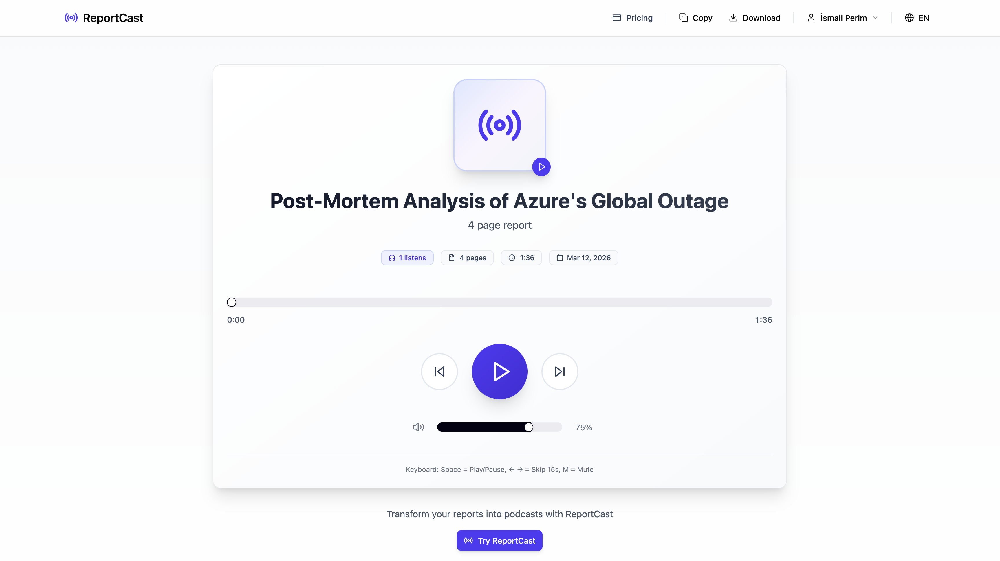
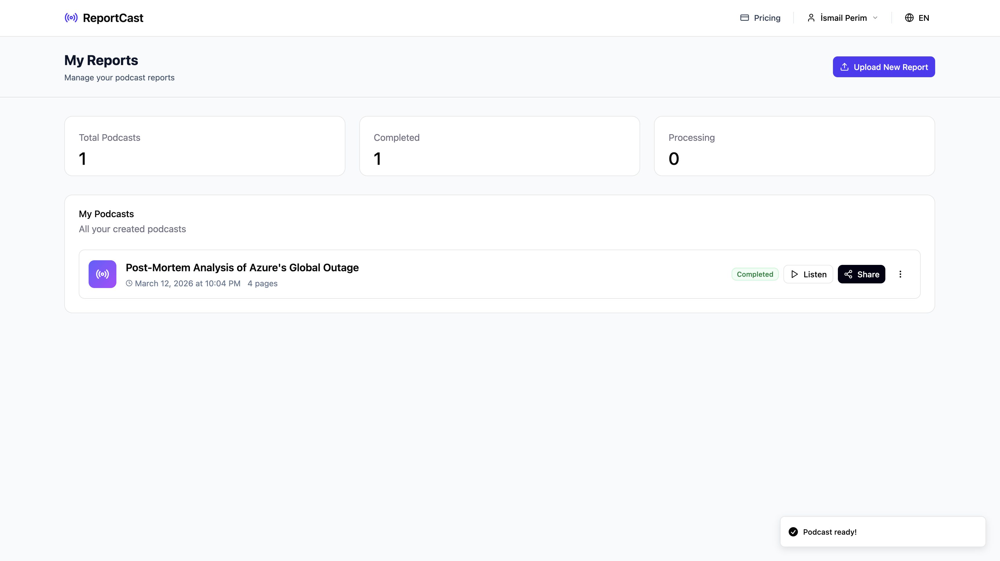
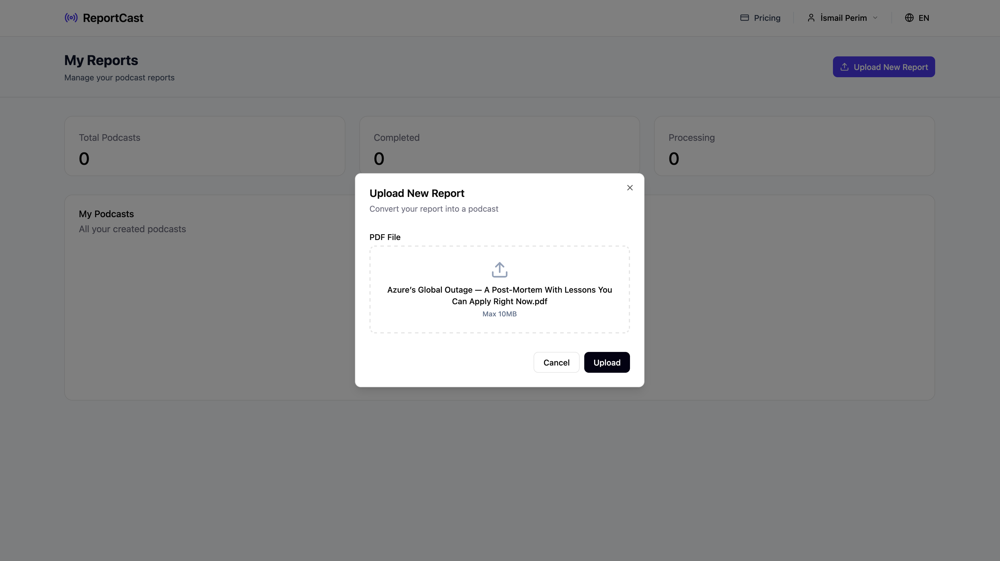
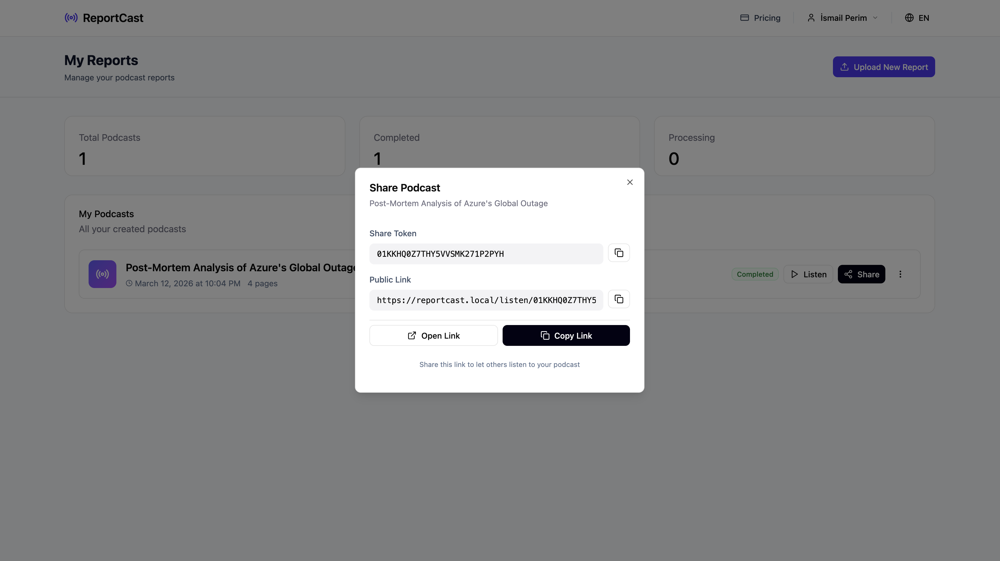

# ReportCast

[](https://github.com/ismailperim/reportcast/actions/workflows/docker-release.yml)
[](https://github.com/ismailperim/reportcast/stargazers)
[](https://github.com/ismailperim/reportcast/issues)
[](https://github.com/ismailperim/reportcast/blob/main/LICENSE)
[](https://github.com/ismailperim?tab=packages&repo_name=reportcast)

> Transform reports into podcasts with AI

Nobody reads your reports. But they'll listen.



## ✨ Features

### Core Capabilities
- 📄 **PDF Parser** - Extract text from any document
- 🤖 **AI Script Generator** - Multiple AI providers (OpenAI, Anthropic, Claude)
- 🎙️ **Multi-Provider TTS** - Cloud (OpenAI, ElevenLabs) or Self-hosted (Piper-GPL)
- 🌍 **Multi-Language** - 7 languages, 19+ voices (Turkish, English, German, French, Spanish, Italian, Dutch)
- 🐳 **Docker Ready** - Full stack with PostgreSQL, Redis, TTS server

### User Experience
- 📜 **Live Transcript Sync** - Read along with auto-highlighting as audio plays
- 🎯 **Smart Language Matching** - Voice selection filtered by language
- 🔗 **Public Sharing** - Anonymous share links with ULID tokens
- 📊 **Listen Analytics** - Track plays, listen count
- 🎨 **Modern UI** - React + Vite frontend with enterprise navbar
- 📱 **Responsive Design** - Works on desktop, tablet, mobile

### Deployment & Pricing
- 💳 **Flexible Pricing** - Pay-per-use credit system (1 credit = 3 pages)
- ⚙️ **Admin Panel** - Manage AI models, TTS voices, settings
- 🏢 **Dual Mode** - On-premise (free, unlimited) or SaaS (paid)

---

## 📸 Screenshots

### Dashboard


### Upload & Processing


### Share Dialog


### Public Player with Transcript


## Quick Start (Production)

### Prerequisites
- Docker & Docker Compose
- 2GB+ RAM
- OpenAI or Anthropic API key (for AI script generation)

### Deploy with Pre-built Images

```bash
# 1. Clone repository
git clone https://github.com/ismailperim/reportcast.git
cd reportcast

# 2. Configure environment
cp .env.example .env
nano .env  # Add your OPENAI_API_KEY or ANTHROPIC_API_KEY

# 3. Start all services (pulls pre-built images from GHCR)
docker compose up -d

# 4. Run migrations
docker exec reportcast-api npm run db:migrate

# 5. Access the application
# API: http://localhost:3000
# Frontend: Build separately or use API directly
```

**What gets deployed:**
- ✅ PostgreSQL 16 (database)
- ✅ Redis 7 (queue backend)
- ✅ Piper TTS (19 pre-loaded voices, CPU-only)
- ✅ API Server (REST API + Auth)
- ✅ Worker (PDF processing + AI + TTS)

**Pre-built images from GitHub Container Registry:**
```bash
ghcr.io/ismailperim/reportcast-api:latest
ghcr.io/ismailperim/reportcast-worker:latest
ghcr.io/ismailperim/reportcast-piper-tts:latest
```

---

## Development Setup

For local development with code changes:

```bash
# 1. Clone repository
git clone https://github.com/ismailperim/reportcast.git
cd reportcast

# 2. Configure environment
cp .env.example .env
nano .env  # Add API keys

# 3. Start with local build (dev mode)
docker compose -f docker-compose.dev.yml up -d

# 4. Run migrations
docker exec reportcast-api npm run db:migrate

# 5. Frontend development server
cd packages/frontend
npm install
npm run dev
# Frontend: http://localhost:5173
```

**Development mode:**
- Uses `docker-compose.dev.yml` (builds locally)
- Hot reload for code changes
- Source code mounted as volumes (optional)

---

## Architecture

```
reportcast/
├── packages/
│   ├── api/        # REST API + Auth + Admin
│   ├── worker/     # BullMQ worker (PDF + AI + TTS)
│   └── frontend/   # React + Vite UI
├── docker-compose.yml       # Production (pre-built images)
├── docker-compose.dev.yml   # Development (local build)
└── Dockerfile.piper-http    # Piper TTS server
```

### TTS Providers

| Provider | Cost | Setup | Languages | Use Case |
|----------|------|-------|-----------|----------|
| **Piper-GPL** ⭐ | FREE | Docker | 100+ | Self-hosted, on-premise |
| OpenAI TTS | $0.015/1K chars | API Key | 50+ | Cloud, convenient |
| ElevenLabs | $0.30/1K chars | API Key | 30+ | Premium quality |

**Default:** Piper-GPL (free, 19 pre-loaded voices)

**Pre-loaded Piper voices:**
- **Turkish:** tr_TR-dfki-medium
- **English:** en_US-lessac-medium, en_US-ryan-medium, en_GB-alan-medium
- **German:** de_DE-thorsten-medium
- **French:** fr_FR-siwis-medium
- **Spanish:** es_ES-mls_10246-low
- **Italian:** it_IT-riccardo-medium
- **Dutch:** nl_NL-mls-medium
- **Russian:** ru_RU-irina-medium

---

## Configuration

### Required Environment Variables

```bash
# AI Provider (required - choose one or both)
OPENAI_API_KEY=sk-proj-...
ANTHROPIC_API_KEY=sk-ant-...

# Database (auto-configured in docker-compose)
DB_PASSWORD=your_secure_password_here

# JWT Secret (change in production!)
JWT_SECRET=your_long_random_secret_string_here
```

### Optional Variables

```bash
# Deployment Mode
DEPLOYMENT_MODE=on-premise  # or "saas" for paid features

# TTS Providers (optional - for premium voices)
ENABLE_OPENAI_TTS=true
ENABLE_ELEVENLABS_TTS=true
ELEVENLABS_API_KEY=...

# Stripe (only for SaaS mode)
STRIPE_SECRET_KEY=sk_test_...
STRIPE_PUBLISHABLE_KEY=pk_test_...
```

Full configuration: See [.env.example](.env.example)

---

## API Endpoints

### Authentication
- `POST /api/auth/register` - Create account
- `POST /api/auth/login` - Get JWT token
- `GET /api/auth/me` - Get user profile

### Upload & Processing
- `POST /api/upload` - Upload PDF (returns reportId)
- `POST /api/upload/:id/confirm` - Start processing with options
- `GET /api/reports` - List user reports
- `GET /api/reports/:id` - Get report details
- `GET /api/reports/:id/download` - Download audio

### Sharing
- `POST /api/share/:id` - Enable public sharing (get ULID token)
- `DELETE /api/share/:id` - Disable sharing
- `GET /api/share/metadata/:token` - Public metadata (no auth)
- `GET /api/stream/:token` - Stream audio (public)

### Configuration
- `GET /api/config/ai-models` - List available AI models
- `GET /api/config/tts-voices` - List TTS voices
- `GET /api/pricing` - Get pricing packages

Full API docs: [docs/API.md](docs/API.md)

---

## Deployment Modes

### 1. On-Premise (Default)
```bash
DEPLOYMENT_MODE=on-premise
```
- ✅ **Free, unlimited** processing
- ✅ All features enabled
- ✅ No payment integration
- ✅ Perfect for internal tools

### 2. SaaS Mode
```bash
DEPLOYMENT_MODE=saas
```
- 💳 Credit-based pricing (1 credit = 3 pages)
- 💰 Stripe payment integration
- 👥 User limits and quotas
- 📊 Usage analytics

---

## Upgrading

### Pull Latest Images (Production)

```bash
# Stop services
docker compose down

# Pull latest images
docker compose pull

# Restart
docker compose up -d

# Run any new migrations
docker exec reportcast-api npm run db:migrate
```

### Rebuild (Development)

```bash
# Stop services
docker compose -f docker-compose.dev.yml down

# Rebuild all images
docker compose -f docker-compose.dev.yml build --no-cache

# Restart
docker compose -f docker-compose.dev.yml up -d
```

---

## Troubleshooting

### Check Service Status
```bash
docker compose ps
docker compose logs api
docker compose logs worker
docker compose logs tts-server
```

### Reset Database
```bash
docker compose down -v  # ⚠️ Deletes all data!
docker compose up -d
docker exec reportcast-api npm run db:migrate
```

### TTS Issues
```bash
# Check TTS server logs
docker compose logs tts-server

# Test TTS directly
curl http://localhost:5000/health
```

### Worker Not Processing
```bash
# Check worker logs
docker compose logs worker -f

# Check Redis
docker exec -it reportcast-redis redis-cli
> PING
> KEYS *
```

---

## Contributing

1. Fork the repository
2. Create a feature branch (`git checkout -b feature/amazing-feature`)
3. Commit changes (`git commit -m 'Add amazing feature'`)
4. Push to branch (`git push origin feature/amazing-feature`)
5. Open a Pull Request

---

## License

MIT License - see [LICENSE](LICENSE) file for details

---

## Support

- 📖 **Documentation:** [docs/](docs/)
- 🐛 **Issues:** [GitHub Issues](https://github.com/ismailperim/reportcast/issues)
- 💬 **Discussions:** [GitHub Discussions](https://github.com/ismailperim/reportcast/discussions)

---

## Acknowledgments

- **Piper TTS** - Free, open-source neural TTS
- **OpenAI** - GPT models & TTS
- **Anthropic** - Claude models
- **BullMQ** - Queue system
- **Drizzle ORM** - Database toolkit

---

Built with ❤️ by [İsmail Perim](https://github.com/ismailperim)
